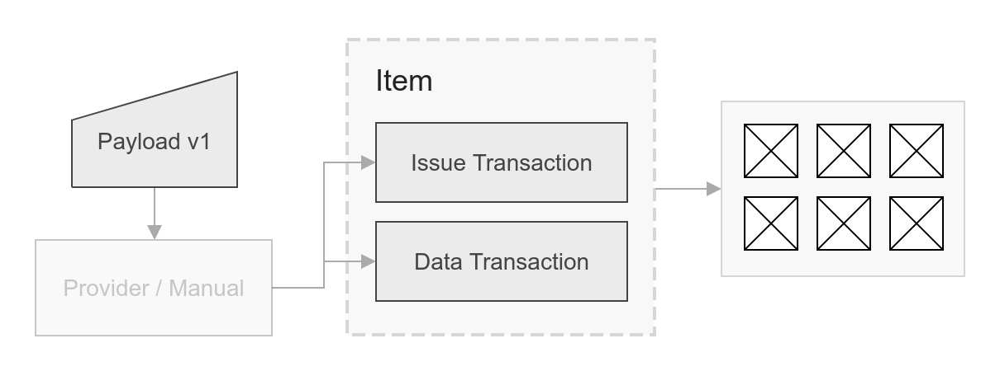

# Core

## Architecture

To represent an item on Waves blockchain you should submit two transactions with a specific format.



### Issue transaction
The first one is issue transaction. It describes an asset - a primitive consensus entity, which will represent an item on the Waves blockchain.

Let's look at the issue transaction that follows the protocol:
```typescript
const issueTx = {
  id: '8GyBZQjQ8GSpxvs9FWnu7MCCUzfJ45oVJQQb3ivLoA17',
  type: 3,
  version: 2,
  name: 'AssetName',
  description: 'Some description of the item',
  quantity: 100,
  script: undefined,
  decimals: 0,
  reissuable: false,
  fee: 100000000,
  timestamp: 1562248791746,
  chainId: 84,
  senderPublicKey: '4Gqd2YuaCMh4PM6nVt33NJbETWMkJ5sHerJQCcd4Fbhe',
  proofs: ['4HkJ5TLM7HFzuiLYrY7CTyoTXcNSVs4tBiMo2Jud7be6rF14Ja9AA2qujFwhFA3WGeRw2QxvuSnc3fceMXNBJpXs']
}
```
This is a standard issue transaction with an extra restrictions:
- *script* should be **undefined**
- *decimals* should be **0**
- *reissuable* should be **false**

> Important! The field `name` is name of your asset. Max length is 16 characters. Use **item payload** for the full name of the item, see below.

You can broadcast transactions to Waves blockchain via node REST API using [/transactions/broadcast](http://nodes.wavesnodes.com/api-docs/index.html#!/transactions/signedBroadcast_1) endpoint.

### Data transaction
The second transaction is data transaction. It describes the particular in-dapp item and holds all the metadata that particular dapp will use. This data transaction must be sourced from the same account.

Here is data transaction example that should follow the issue transaction from the first section: 

```typescript
const dataTx = {
  id: 'DJadLmeQkcU4f7eGdXAqnSoKwLJbpZ3eXRMJSVcbnGT6',
  type: 12,
  version: 1,
  data: [{
      type: 'string',
      key: '8GyBZQjQ8GSpxvs9FWnu7MCCUzfJ45oVJQQb3ivLoA17',
      value: '{"version":1,"name":"The sword of pain","imageUrl":"https://example.com/item.png","misc":{"damage":1}}'
  }]
  fee: 100000,
  timestamp: 1562248791771,
  senderPublicKey: '4Gqd2YuaCMh4PM6nVt33NJbETWMkJ5sHerJQCcd4Fbhe',
  proofs: ['4i4e4cCvTajmSUFonzeRGhMNxHMX5S5E3jaq1fDdJ7svC74vspRm8ZPSMX3zdx7AfZ51A85HMZj6ywrENuZxTKcK'],
}
```
This is a standard data transaction with an extra restrictions:
- *data key* should equal to **issue transaction ID**
- *data value* should be a serialised **JSON string with an item payload object**

#### Item payload v1
Payload is an convention entity that has the following format:

```json
{
  "version": 1,
  "name": "The sword of pain",
  "imageUrl": "https://example.com/item.png",
  "misc": {
    "damage": 1
  }
}
```
It describes the item and may contain the optional **misc** field with the item properties.


Also, you can use general npm [package](https://github.com/wavesplatform/item/tree/master/packages/provider) `@item/provider` to create an item by one method.